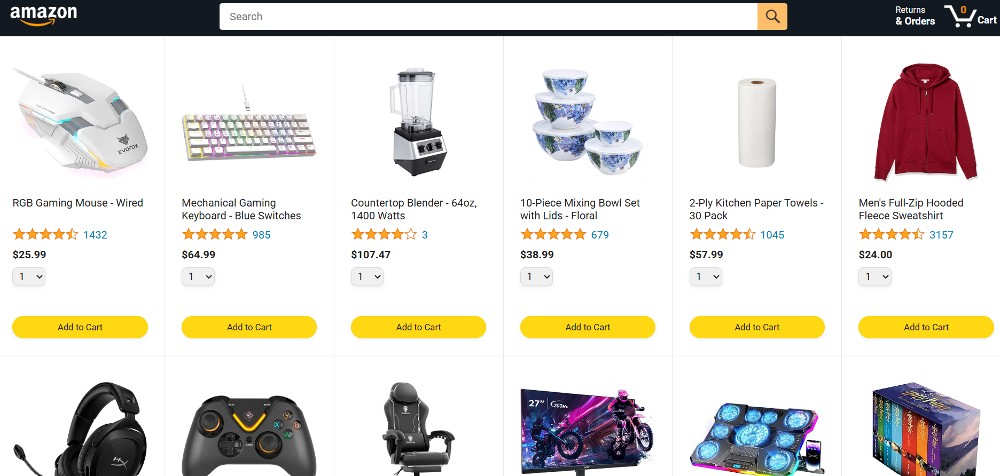
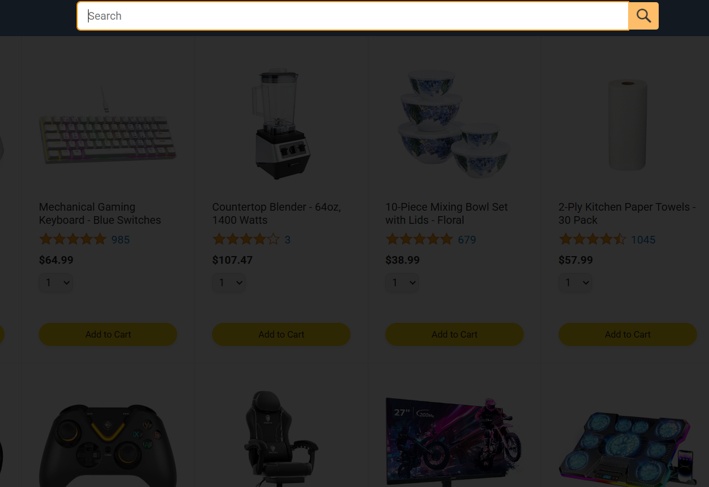
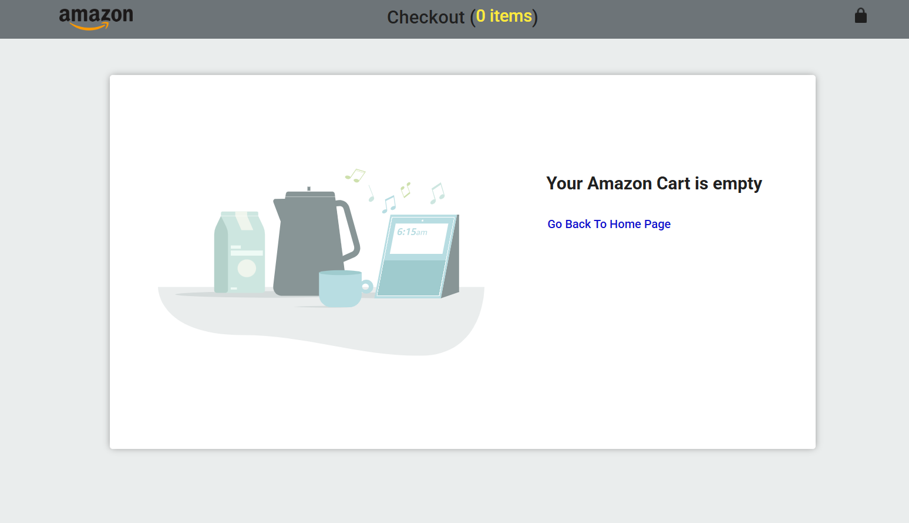
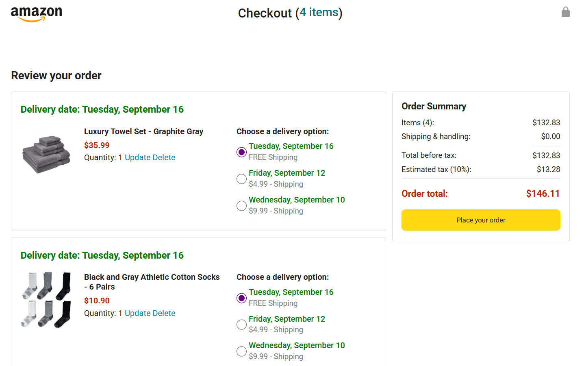
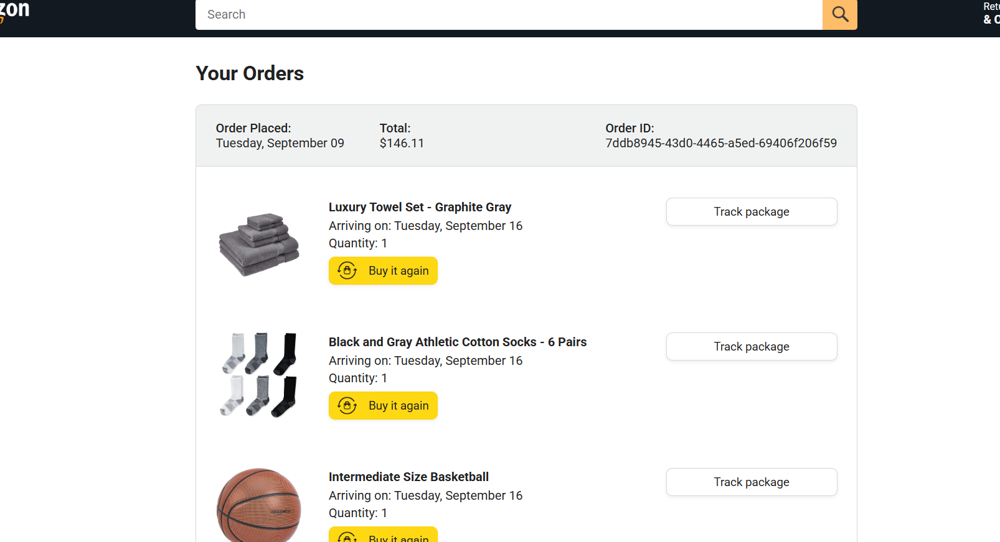
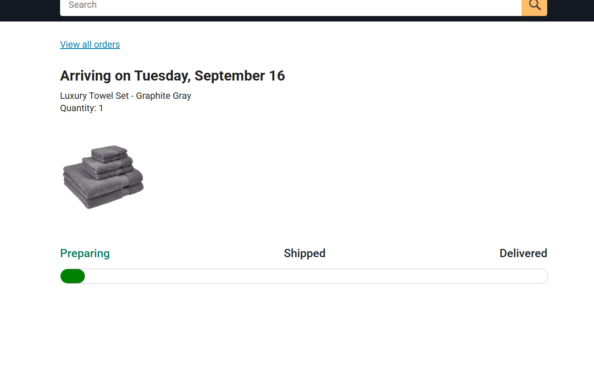

# 🛒 Amazon Frontend Clone  

A responsive **Amazon clone website** built with **HTML, CSS, and JavaScript**, replicating the look and feel of the Amazon homepage.  

---

## Live Demo  
🔗 

---

## 📌 Features  
- 🖥️ Multi-page layout (Home, Cart, Orders, etc.)  
- 🎨 Fully responsive design for desktop & mobile  
- 🔍 Search bar, product cards, and navigation bar  
- 🛍️ Add to Cart button styling and hover effects  
- 📦 Clean, structured code for scalability  

---

## 🛠️ Tech Stack  
- **HTML5** – Page structure  
- **CSS3** – Styling & responsiveness  
- **JavaScript** – Interactivity  

---

# Project Screenshots

